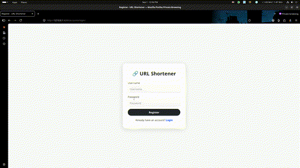

# 🚀 URL Shortener — Django Project

<div align="center">

[](https://www.python.org/)
[](https://www.djangoproject.com/)
[](https://getbootstrap.com/)
[](https://www.sqlite.org/)

[](LICENSE)
[](https://github.com/vishnuvm1122/url-shortner)

[](https://www.linkedin.com/in/vishnuvm1997/)
[](https://github.com/vishnuvm1122)

</div>

---

## 🎬 Demo & Preview

> **Watch the magic happen!** Convert any long URL into a compact, shareable short link in seconds.



*GIF showing the full URL shortening workflow with dashboard analytics*

---

## 📑 Table of Contents

<details open>
<summary><b>Click to expand/collapse</b></summary>

- [✨ Overview](#-overview)
- [🎯 Key Features](#-key-features)
- [🛠️ Technologies Used](#️-technologies-used)
- [📦 Installation Guide](#-installation-guide)
- [🚀 Quick Start](#-quick-start)
- [💡 Usage Examples](#-usage-examples)
- [🎛️ Admin Panel](#️-admin-panel)
- [🔒 Security Features](#-security-features)
- [🐛 Troubleshooting](#-troubleshooting)
- [📄 License & Credits](#-license--credits)

</details>

---

## ✨ Overview

> A **production-ready** Django-based URL Shortener that transforms long, complex URLs into clean, shareable short links.

### What Does It Do? 🤔

```
📥 Long URL
  ↓
🔄 URL Shortener Magic
  ↓
✨ Short, Shareable Link
  ↓
📊 Click Tracking & Analytics
  ↓
🎯 Redirect to Original URL
```

### Perfect For:
- 📱 **Social Media:** Share links that fit character limits
- 🔗 **Marketing:** Track campaign performance
- 📊 **Analytics:** Monitor link clicks and visitor details
- 🎯 **QR Codes:** Generate clean URLs for QR code generation

---

## 🎯 Key Features

### 🔐 User Authentication & Account Management
<table>
<tr>
<td>

✅ **User Registration**
- Email verification
- Password strength validation
- Username uniqueness checks

</td>
<td>

✅ **Secure Login/Logout**
- Session-based authentication
- Password hashing with Django
- CSRF protection

</td>
</tr>
<tr>
<td>

✅ **Profile Management**
- Update personal information
- Change email address
- Modify password securely

</td>
<td>

✅ **Account Recovery**
- Password reset functionality
- Email verification
- Security best practices

</td>
</tr>
</table>

### 🔗 URL Shortening & Management
<table>
<tr>
<td>

🔹 **Create Short URLs**
- Custom or auto-generated codes
- 6-10 character unique identifiers
- One-click URL generation

</td>
<td>

✏️ **Edit & Delete**
- Modify original URLs anytime
- Bulk operations supported
- Version history tracking

</td>
</tr>
<tr>
<td>

🌍 **Redirect & Routing**
- Smart redirect logic
- Active/inactive toggle
- Link expiration options

</td>
<td>

⚡ **AJAX Operations**
- Lightning-fast page updates
- No full page refreshes
- Smooth user experience

</td>
</tr>
</table>

### 📊 Click Tracking & Analytics
<table>
<tr>
<td>

🌐 **IP Address Tracking**
- Geolocation capabilities
- Duplicate click detection
- Traffic source analysis

</td>
<td>

🖥️ **Device Detection**
- Browser identification
- OS/Platform detection
- Device type classification
- Mobile vs Desktop split

</td>
</tr>
<tr>
<td>

📈 **Click History**
- Real-time click counter
- Historical click records
- Click timeline visualization

</td>
<td>

📋 **Analytics Dashboard**
- Click statistics per URL
- Performance graphs
- Export click data

</td>
</tr>
</table>

### 🎛️ Admin Control Panel
<table>
<tr>
<td>

👨‍💼 **URL Management**
- View all URLs in system
- Search & filter options
- Bulk actions support
- Click count visibility

</td>
<td>

📊 **Click Management**
- Browse all click records
- Filter by date/IP/browser
- Delete spam clicks
- Export analytics

</td>
</tr>
<tr>
<td>

👥 **User Management**
- View registered users
- Disable user accounts
- Reset user passwords
- Monitor user activity

</td>
<td>

🔍 **Advanced Filtering**
- Search by URL/user/date
- Multi-filter combinations
- Sort capabilities
- Bulk operations

</td>
</tr>
</table>

---

## 🛠️ Technologies Used

<table>
<tr>
<td align="center" width="25%">

### 🐍 Backend
**Python 3.8+**
**Django 3.x/4.x**
**Django ORM**

</td>
<td align="center" width="25%">

### 💾 Database
**SQLite** (Dev)
**PostgreSQL** (Prod)
**dj-database-url**

</td>
<td align="center" width="25%">

### 🎨 Frontend
**Bootstrap 5**
**HTML5**
**CSS3**
**JavaScript**

</td>
<td align="center" width="25%">

### 🚀 Deployment
**WhiteNoise**
**Gunicorn**
**Heroku Ready**

</td>
</tr>
</table>

### Additional Libraries
- 🔍 **user-agents:** Browser & device detection
- 🎨 **django-jazzmin:** Beautiful admin UI
- 🔐 **django-cors-headers:** CORS support
- 📦 **requests:** HTTP library
- 🌐 **psycopg2:** PostgreSQL adapter

---

## 📦 Installation Guide

### Prerequisites ✅

Before you start, ensure you have:

```
✅ Python 3.8 or higher
✅ pip (Python Package Manager)
✅ Git (Version Control)
✅ Virtual Environment (Recommended)
✅ 50MB Free Disk Space
```

### Step-by-Step Installation 🎯

<details open>
<summary><b>📋 Click to expand installation steps</b></summary>

#### 1️⃣ Clone the Repository

```bash
git clone https://github.com/vishnuvm1122/url-shortner.git
cd url-shortner
```

#### 2️⃣ Create Virtual Environment

```bash
# Linux/macOS
python3 -m venv venv

# Windows
python -m venv venv
```

#### 3️⃣ Activate Virtual Environment

```bash
# Linux/macOS
source venv/bin/activate

# Windows Command Prompt
venv\Scripts\activate

# Windows PowerShell
venv\Scripts\Activate.ps1
```

✅ You should see `(venv)` in your terminal

#### 4️⃣ Upgrade pip

```bash
python -m pip install --upgrade pip
```

#### 5️⃣ Install Dependencies

```bash
pip install -r requirements.txt
```

#### 6️⃣ Run Migrations

```bash
python manage.py migrate
```

#### 7️⃣ Create Superuser Account

```bash
python manage.py createsuperuser
```

Enter your credentials:
- **Username:** Choose a username (e.g., `admin`)
- **Email:** Your email address
- **Password:** Strong password (8+ characters)

#### 8️⃣ Run Development Server

```bash
python manage.py runserver
```

🎉 **Server is running!**

Open your browser:
- 🏠 **Application:** http://127.0.0.1:8000/
- 🎛️ **Admin:** http://127.0.0.1:8000/admin/

</details>

---

## 🚀 Quick Start

### First Time Setup (5 minutes)

```bash
# 1. Clone & Setup
git clone https://github.com/vishnuvm1122/url-shortner.git
cd url-shortner

# 2. Virtual Environment
python3 -m venv venv && source venv/bin/activate

# 3. Install & Migrate
pip install -r requirements.txt
python manage.py migrate

# 4. Create Admin
python manage.py createsuperuser

# 5. Run Server
python manage.py runserver

# ✅ Visit http://127.0.0.1:8000/
```

---

## 💡 Usage Examples

### 📝 Creating Your First Short URL

1. **Register** on the home page
2. **Login** to your account
3. **Go to Dashboard**
4. **Enter Long URL:**
   ```
   https://example.com/products/category/subcategory/item?id=12345&ref=email
   ```
5. **Click "Shorten URL"**
6. **Get:** `http://your-domain.com/aB12x9`
7. **Share & Track!** 🎉

### 📊 Viewing Analytics

```
Your Dashboard → Select URL → Click Analytics
                    ↓
          See all visitor details:
          - IP Address: 192.168.1.1
          - Browser: Chrome 121.0
          - Platform: Windows 10
          - Device: Desktop
          - Click Time: 2024-09-01 14:30:45
```

### 🔗 Managing URLs

| Action | Steps |
|--------|-------|
| **Edit URL** | Dashboard → Select URL → Click Edit → Update → Save |
| **Delete URL** | Dashboard → Select URL → Click Delete → Confirm |
| **Copy Link** | Dashboard → Hover URL → Click Copy Icon |
| **View Stats** | Dashboard → Select URL → View Clicks |

---

## 🎛️ Admin Panel Guide

### Access Admin Dashboard

```
URL: http://127.0.0.1:8000/admin/
Username: (your superuser username)
Password: (your superuser password)
```

### Admin Features

#### 🔗 URL Management
- View all shortened URLs
- Search by UUID or original link
- Filter by user/date/status
- Edit active status
- Delete URLs and associated clicks
- Sort by click count

#### 📊 Click Analytics
- Browse complete click history
- Filter by URL/IP/Browser/Platform
- Sort by date
- Delete individual click records
- Export click data (future feature)
- Identify trending links

#### 👥 User Management
- View registered users
- Manage user permissions
- Deactivate accounts
- Reset passwords
- Track user activity

#### 🔍 Advanced Filtering
```
Example Filters:
- Show URLs created in last 7 days
- Filter clicks from Chrome browser
- Show URLs with 100+ clicks
- Display URLs by specific users
```

---

## 🔒 Security Features

### Built-in Protections ✅

| Feature | Description |
|---------|-------------|
| 🔐 **CSRF Protection** | Django CSRF middleware on all forms |
| 🔑 **Password Hashing** | PBKDF2 algorithm with salt |
| 👤 **IDOR Prevention** | Users can only manage their own URLs |
| 📝 **Input Validation** | URL format validation & sanitization |
| 🚫 **SQL Injection Safe** | Django ORM protects against SQL injection |
| 🔒 **Session Security** | Secure session management |

### Production Recommendations 🛡️

```python
# Enable these in production:
DEBUG = False
SECURE_SSL_REDIRECT = True
SESSION_COOKIE_SECURE = True
CSRF_COOKIE_SECURE = True
SECURE_BROWSER_XSS_FILTER = True
SECURE_CONTENT_TYPE_NOSNIFF = True
X_FRAME_OPTIONS = "DENY"
SECURE_HSTS_SECONDS = 31536000
```

---

## 🐛 Troubleshooting

### Common Issues & Solutions

<details>
<summary><b>❓ Python command not found</b></summary>

**Error:** `command not found: python`

**Solution:** Use `python3` instead of `python`
```bash
python3 -m venv venv
python3 manage.py runserver
```

</details>

<details>
<summary><b>❓ ModuleNotFoundError: No module named 'django'</b></summary>

**Error:** Module not found

**Solution:** Ensure virtual environment is activated
```bash
# Check if (venv) appears in terminal
source venv/bin/activate  # Linux/macOS
pip install -r requirements.txt
```

</details>

<details>
<summary><b>❓ Port 8000 already in use</b></summary>

**Error:** `Address already in use`

**Solution:** Use a different port
```bash
python manage.py runserver 8001
python manage.py runserver 3000
```

</details>

<details>
<summary><b>❓ Database migration errors</b></summary>

**Error:** Migration conflict

**Solution:** Reset migrations (dev only!)
```bash
python manage.py migrate --fake-initial
# Or fresh start:
rm db.sqlite3
python manage.py migrate
```

</details>

<details>
<summary><b>❓ Static files not loading</b></summary>

**Error:** CSS/JS files missing

**Solution:** Collect static files
```bash
python manage.py collectstatic --noinput
```

</details>

---

## 📂 Project Structure

```
url-shortner/
│
├── 📁 config/                    # Django Configuration
│   ├── settings.py              # Settings file
│   ├── urls.py                  # URL routing
│   ├── wsgi.py                  # WSGI config
│   └── asgi.py                  # ASGI config
│
├── 📁 shortner/                 # Main App
│   ├── models.py               # Database models
│   ├── views.py                # View logic
│   ├── urls.py                 # App URLs
│   ├── admin.py                # Admin configuration
│   ├── forms.py                # Form classes
│   └── migrations/             # Database migrations
│
├── 📁 users/                    # User App
│   ├── models.py               # User models
│   ├── views.py                # Auth views
│   ├── forms.py                # Auth forms
│   └── migrations/
│
├── 📁 templates/               # HTML Templates
│   ├── layouts/               # Base templates
│   ├── shortner/              # App templates
│   ├── accounts/              # Auth templates
│   └── includes/              # Reusable components
│
├── 📁 static/                  # Static Files
│   ├── css/                   # Stylesheets
│   ├── js/                    # JavaScript
│   └── images/                # Images & icons
│
├── 📁 files/                   # Media Files
│   └── screen-demo.gif        # Demo animation
│
├── manage.py                   # Django CLI
├── requirements.txt            # Dependencies
├── db.sqlite3                  # SQLite Database
└── Readme                      # This file!
```

---

## 🌟 Key Highlights

| Feature | Benefit |
|---------|---------|
| 🎯 **Simple Interface** | One-click URL shortening |
| 📊 **Real-time Analytics** | Track clicks instantly |
| 🔒 **Secure** | Industry-standard security |
| ⚡ **Fast** | Lightning-quick redirects |
| 📱 **Responsive** | Works on all devices |
| 🎨 **Beautiful UI** | Modern Bootstrap design |
| 👨‍💻 **Developer Friendly** | Clean, documented code |
| 🚀 **Scalable** | Ready for production |

---

## 🚀 Deployment Options

### Local Development
```bash
python manage.py runserver
```

### Production with Gunicorn
```bash
pip install gunicorn
gunicorn config.wsgi:application --bind 0.0.0.0:8000
```

### Deploy to Heroku
```bash
heroku create your-app-name
git push heroku main
heroku run python manage.py migrate
heroku run python manage.py createsuperuser
```

### Deploy with Docker
```bash
docker build -t url-shortner .
docker run -p 8000:8000 url-shortner
```

---

## 📄 License & Credits

### License
This project is licensed under the **MIT License** - see [LICENSE](LICENSE) for details.

```
MIT License

Permission is hereby granted, free of charge, to any person obtaining a copy
of this software and associated documentation files (the "Software"), to deal
in the Software without restriction, including without limitation the rights
to use, copy, modify, merge, publish, distribute, sublicense, and/or sell
copies of the Software, and to permit persons to whom the Software is
furnished to do so, subject to the following conditions:
...
```

### Author 👨‍💻

**Vishnu VM**
- 🔗 Portfolio: [vishnuvm.com](https://vishnuvm.com)
- 💼 LinkedIn: [linkedin.com/in/vishnuvm1997](https://www.linkedin.com/in/vishnuvm1997/)
- 🐙 GitHub: [@vishnuvm1122](https://github.com/vishnuvm1122)
- 📧 Email: vishnuedappal1122@gmail.com

---

## ⭐ Show Your Support

<div align="center">

If this project helped you, please give it a **⭐ Star**!

It helps others discover this project and motivates development.

[](https://github.com/vishnuvm1122/url-shortner)

**Fork • Star • Share • Contribute** 🚀

</div>

---

## 📊 Stats & Metrics

<div align="center">


</div>

---

<div align="center">

## 🙏 Thank You!

**Made with ❤️ by Vishnu VM**

Last Updated: 2026 | Active Development ✅

[⬆ Back to top](#-url-shortener--django-project)

</div>
